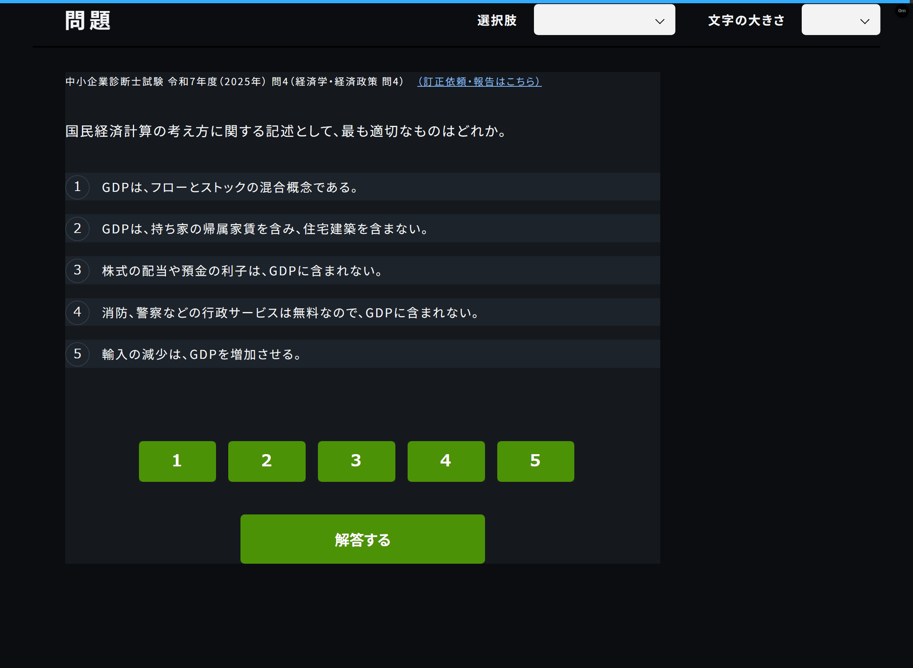

  
READ / RECALL / REPEAT

  <h1>kakomonn</h1>
  
<strong>読んで, 解いて, 忘れる前に.</strong>

  
過去問ドットコムでの学習に, 読み上げと間隔反復を.

  

    
    
    
    
  

  

    <a href="https://github.com/expgolemclone/kakomonn/releases/latest/download/kakomonn-reader.user.js"><strong>Userscriptを入手</strong></a>
    / <a href="docs/guide.md">利用と開発</a>
    / <a href="kakomonn-sync/README.md#学習ログ">学習ログ</a>
  

  

---

  <h2><a href="https://kakomonn.com/">過去問ドットコム / kakomonn.com</a></h2>
  
豊富な過去問と解説を無料で公開してくださる運営の皆さんに感謝. 資格の勉強を始めるなら, まずはこちらへ.

  
<a href="https://kakomonn.com/"><strong>&rarr; 過去問ドットコムで勉強する &larr;</strong></a>

  
本プロジェクトは非公式の学習補助ツールです. 過去問ドットコムの運営とは関係ありません.

---

## Tools

| Component                               | 役割                                                  |
| --------------------------------------- | ----------------------------------------------------- |
| [**Reader**](kakomonn-reader/README.md) | 問題と解説の読み上げ, キーボード操作, Markdownコピー. |
| [**Sync**](kakomonn-sync/README.md)     | FSRSで次の問題を選び, 学習記録を端末間で共有.         |

Windows Chrome + Tampermonkey Beta / iPhone Safari + Tampermonkey.

[起動と設定](docs/guide.md#普段使いのchrome) / [テスト](docs/guide.md#テスト) / [リリース](docs/guide.md#release-and-deployment) / [Credits](docs/guide.md#acknowledgements)
